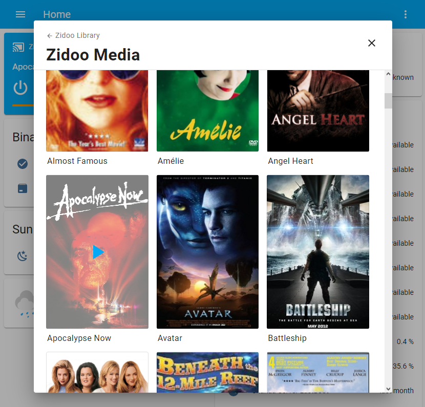

# Home-assistant component for Zidoo media players

This is a functioning solution for controlling my Z9S Zidoo media player on Home-Assistant.  Based on the Zidoo REST API, it should work on all Zidoo devices (feedback/PRs welcome)

## Features

- Control Zidoo devices as media players through HA
- Album art and movie backdrops
- Browse movies, file system, and share mounts through HA Media Browser 

  
  

## Installation

### HACS Install 

1. Search for `Zidoo` under `Integrations` in the HACS Store tab.
2. **You will need to restart after installation for the component to start working.**
3. Configure the integation (see Configuration section)

### Manual Install

1. Copy `zidoo` folder from zidoo-player/custom_components to `\config\custom_components` (create folder if this is your first custom integration)
2. Restart HA

### Configuration

1. Add `Zidoo` Integration from the 'Configuraion-Integration' menu
2. Add the IP address of player
3. Enter the Password if you have authentication enabled
4. Add standard Media Control card for newly added media_player device 

## FAQs
> If you installed versions prior to 1.2.5 using HACS and the integration is not availble in ADD INTEGRATIONS
>  1. See  [Add / Remove HACS Integration](add_remove.md)
>  2. Clear your Browser Cache
>  
> If you have issues connecting with the device, it may be an authorization issue.  
>  1. Try opening the 'Control Center' app on the media player and retry. 
>  2. Try turning off validation using the button in the app.   
>
> Release 1.2 was tested up to HA version 2021.10 and uses config-flow.   
> Release 1.1 can be used on older HA versions, requires manual integration and is limited to basic player control.

## ToDo

- Testing on other devices
  - WOL (does not work on Z9S due to hardware limitations - reportedly works on Z9X)
  - Authentication ( not sure if newer devices are more secure)
  - Possible device specific options.   
- Add Coverflow options for Shortcuts in Media Browse
- Add Discovery?
- ZidooRC API will eventually need to be released as a python library per HA requirements.  

