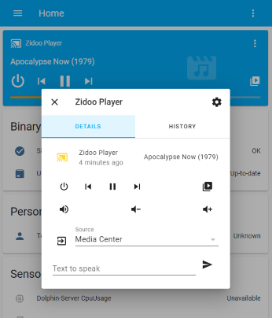

# Home-assistant component for Zidoo media players
HA media-player and api wrapper.

This is a functioning solution for controlling my Z9S Zidoo media player on Home-Assistant.  Based on the Zidoo rest api, it should work on other devices (feedback/PRs welcome)

ZidooRC will eventually need to be released as a python library per HA requirements.  

Includes Media Browse support with favorites (although the latter is work-in-progress - currently hard-coded into media_player)

1.2 is tested up to HA version 2021.10 and uses cover-flow.   
Release 1.1 is tested from HA versions 2021.1 up to 2021.10, and requires manual integration.

  


## Installation

### HACS Install 

NOTE:  HACS/default PR is awaiting review.  Until then you would have to add the https://github.com/wizmo2/zidoo-player as a custom repository or use the manual method.

1. Search for `Zidoo` under `Integrations` in the HACS Store tab.
2. **You will need to restart after installation for the component to start working.**
3. Configure the integation (see Configuration section)

### Manual Install

1. Copy `zidoo` folder from zidoo-player/custom_components to `\config\custom_components` (create folder if this is your first custom integration)
2. Restart HA

### Configuration

for latest version:

1. Add `Zidoo` Integration from the 'Configuraion-Integration' menu
2. Add the IP address of player
3. Enter the Password if you have authentication enabled

for version 1.1:

1. Edit your `/config/configuration.yaml` with

```
media_player:
  - platform: zidoo
    name: Zidoo
    host: 192.168.1.11
```
2. Restart HA

> If you have issues connecting with the device, it may be an authorization issue.  
>  1. Try opening the 'Control Center' app and retry. 
>  2. Try turning off validation using the button in the app.   

## ToDo

- Testing on other devices
  - WOL (does not work on Z9S due to hardware limitations - current code uses ethernet mac address)
  - Authentication ( not sure if newer devices are more secure)
  - Possible device specific options.   
- Add Coverflow options for Shortcuts in Media Browse
- Add Discovery?


