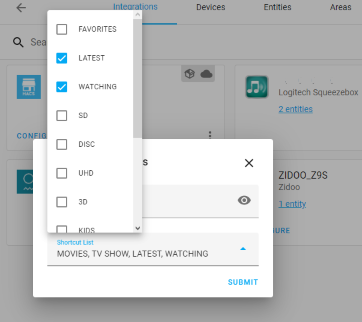

# Home-assistant component for Zidoo media players

This is a functioning solution for controlling Zidoo media player on Home-Assistant.  Based on the Zidoo REST API, it is developed using a Z9S, but should work on all Zidoo devices (feedback/PRs welcome)

## Features

- Control Zidoo devices as media players through HA
- Album art and movie backdrops
- Browse movies, music, file system, and share mounts through HA Media Browser
- Keyword [Searches](services.md)

  
  

## Installation

### HACS Install 

1. Search for `Zidoo` under `Integrations` in the HACS Store tab.
2. **You will need to restart after installation for the component to start working.**
3. Configure the integation (see Configuration section)

### Manual Install

1. Copy `zidoo` folder from zidoo-player/custom_components to `\config\custom_components` (create folder if this is your first custom integration)
2. Restart HA

### Configuration

1. Add `Zidoo` Integration from the 'Configuraion-Integration' menu
2. Enter the IP address of player
3. Enter the Password if you have authentication enabled
4. Add standard Media Control card for newly added media_player device

### Options

Access the Options menu by pressing the CONFIGURE button on the Integration card

The Media browser allows access to the Movie Libary, plus file access to local devices and saved SMB shares.  By default, the RECENT, MOVIE and TVSHOW Library searches are displayed.  Additional search shortcuts can be added.[^3]. 

Use Power Off control to enable Standby instead of a full power down.[^4]

## FAQs
> Q: Power-on does not work
>
> 1. _WOL does not work on Z9S due to hardware limitiations._
> 2. _To send the WOL message from a Docker container, you either need to reconfigure the container with the '--net=host', or have some type of WOL gateway setup_
>
> Q: What else?
>
> A. If you installed versions prior to 1.2.5 using HACS and the integration is not availble in ADD INTEGRATIONS
>  1. _See  [Add / Remove HACS Integration](add_remove.md)_
>  2. _Clear your Browser Cache_
>  
> A. If you have issues connecting with the device, it may be an authorization issue.  
>  1. _Try opening the 'Control Center' app on the media player and retry._
>  2. _Try turning off validation using the button in the app._  
>
> A. To switch from Wifi to LAN, the integration must be deleted and re added to update the new IP Address  

## ToDo

- Testing on other devices
- Add Coverflow options for additional file shortcuts in Media Browser
- Add Discovery (dev branch tested with z9s, need testing and/or DNLA header information for other device support)
- ZidooRC API will eventually be need to be released as a python library per HA requirements.

## Major Changes

[^1]: Release 1.1 - can be used on older HA versions, requires manual integration and is limited to basic player control.
[^2]: Release 1.2 - adds config flow
[^3]: Release 1.2.9 - Extended search shortcuts.  Requires HA 2022.2 or above
[^4]: Release 1.2.10 - Standby option.  Not recommended on Z9S

