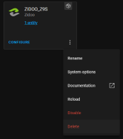
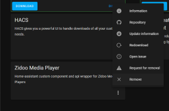
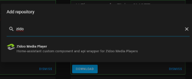
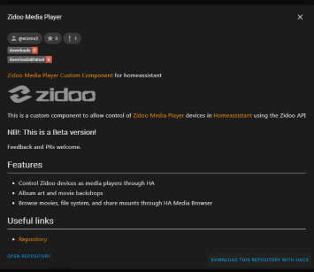
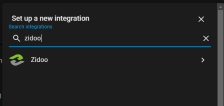
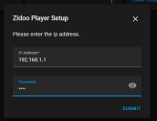
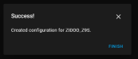

## Fixing HACS download problems

An issue with the HACS configuration file was introduced in release versions 1.2.4 and below, which prevents Versions from downloading correctly.

v1.2.5 fixes the issue, but if a previous version had been installed the following procedure is required to add and remove the HACS install.

_NOTE:  Older versions have been re-built and re-released with the correct HACS configuration file to prevent ongoing issues (using 'v' prefix to the tags)_

### Remove any existing HA integrations

1. Goto Configuration/Integrations and remove any installed media player devices

a. For each Zidoo Media Player, Press the Menu icon and select Delete

### Remove the HACS Integration

2. Goto HACS/Integrations

 

a. Press the Menu icon in the Zidoo Media Player integration, and select Remove

3. Goto Configuration/Server Controls and restart HA

a. Restart HA Server

### Re-Download the HACS Integration

4. Goto HACS/Integrations

 

a. Press the EXPLORE & DOWNLOAD REPOSITORIES button

b. Search for Zidoo and select Zidoo Media Player

c. Press DOWNLOAD REPOSITORY WITH HACS

d.  Select the latest version and press Download

5. Goto Configuration/Server Controls and restart HA

a. Restart HA Server

### Add Media Player Devices

6.  Goto Configuration/Integrations

  

a.  Press the ADD INTEGRATION button

b.  Search for Zidoo and select Zidoo

d.  Enter the IP address and Password (if applicable)

