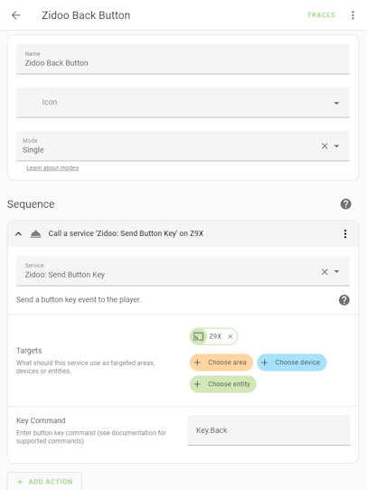

# Zidoo Button Service

The `zidoo.send_key` (Send Button Key) service can be used to issue a remote key command to the player.  The service can be called as a Lovelace action (Tap, Hold), in a Script, or an Automation.  Use any of the button keys from the "Key Command" list in the table below.



Yaml button example:
```
type: button
show_name: false
show_icon: true
tap_action:
  action: call-service
  service: zidoo.send_key
  target:
    entity_id: media_player.z9x
  data:
    key: Key.Back
icon: mdi:backspace
icon_height: 35px
```

## Zidoo button key command list

| Key Command | Action |
|--------------------|--------------------|
| Key.Back | Back |
| Key.Cancel | Cancel |
| Key.Home | Home |		
| Key.Up | Up |
| Key.Down | Down |
| Key.Left | Left |
| Key.Right | Right |
| Key.Ok | Ok |
| Key.Select | Select |
| Key.Star | Star |
| Key.Pound | Pound |
| Key.Dash | Dash |
| Key.Menu | Menu |
| Key.MediaPlay | MediaPlay |
| Key.MediaStop | MediaStop |
| Key.MediaPause | MediaPause |
| Key.MediaNext | MediaNext |
| Key.MediaPrev | MediaPrev |
| Key.Number_0 | Number_0 |
| Key.Number_1 | Number_1 |
| Key.Number_2 | Number_2 |
| Key.Number_3 | Number_3 |
| Key.Number_4 | Number_4 |
| Key.Number_5 | Number_5 |
| Key.Number_6 | Number_6 |
| Key.Number_7 | Number_7 |
| Key.Number_8 | Number_8 |
| Key.Number_9 | Number_9 |
| Key.UserDefine_A | UserDefine_A |
| Key.UserDefine_B | UserDefine_B |
| Key.UserDefine_C | UserDefine_C |
| Key.UserDefine_D | UserDefine_D |
| Key.Mute | Mute |
| Key.VolumeUp | VolumeUp |
| Key.VolumeDown | VolumeDown |
| Key.PowerOn | PowerOn |
| Key.MediaBackward | MediaBackward |
| Key.MediaForward | MediaForward |
| Key.Info |Info |
| Key.Record | Record |
| Key.PageUP | PageUP |
| Key.PageDown | PageDown |
| Key.Subtitle | Subtitle |
| Key.Audio | Audio |
| Key.Repeat | Repeat |
| Key.Mouse | Mouse |
| Key.PopMenu | PopMenu |
| Key.movie | movie |
| Key.music | music |
| Key.photo | photo |
| Key.file | file |
| Key.light | light |
| Key.Resolution | Resolution |
| Key.PowerOn.Reboot | PowerOn Reboot |
| Key.PowerOn.Poweroff | PowerOn Poweroff |
| Key.PowerOn.Standby | PowerOn Standby |
| Key.Pip | Pip |
| Key.Screenshot | Screenshot |
| Key.APP.Switch | APP Switch |

