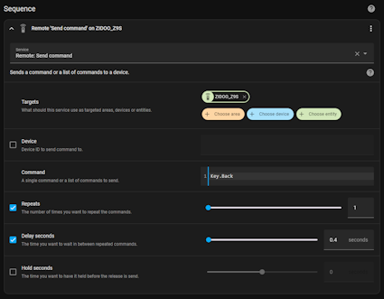
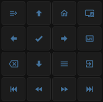

# Zidoo Button Service

The `remote.send_command` (Remote: Send Command) service can be used to issue a remote key command to the player.  The service can be called as a Lovelace action (Tap, Hold), in a Script, or an Automation.  Use any of the button keys from the "Key Command" list in the table below.

_NOTE: `zidoo.send_key` is depreciated and will be removed in a future release._




<details>
  <summary>yaml details:</summary>
  
  ### Frontend Keypad Example
  ```yaml
square: true
type: grid
cards:
  - show_name: false
    show_icon: true
    type: button
    tap_action:
      action: call-service
      service: remote.send_command
      target:
        entity_id: remote.zidoo_z9s
      data:
        command: Key.Info
    entity: ''
    icon: mdi:menu-close
    name: PopMenu
    hold_action:
      action: call-service
      service: remote.send_command
      target:
        entity_id: media_player.zidoo_z9s
      data:
        command: Key.PopMenu
  - show_name: false
    show_icon: true
    type: button
    tap_action:
      action: call-service
      service: remote.send_command
      target:
        entity_id: remote.zidoo_z9s
      data:
        command: Key.Up
    entity: ''
    icon: mdi:arrow-up-bold
    name: Up
    hold_action:
      action: none
  - show_name: false
    show_icon: true
    type: button
    tap_action:
      action: call-service
      service: remote.send_command
      target:
        entity_id: remote.zidoo_z9s
      data:
        command: Key.Home
    entity: ''
    icon: mdi:home-outline
    name: Home
    hold_action:
      action: none
  - show_name: false
    show_icon: true
    type: button
    tap_action:
      action: call-service
      service: zidoo.set_audio
      target:
        entity_id: media_player.zidoo_z9s
      data: {}
    entity: ''
    icon: mdi:television-speaker
    name: Audio Track
    hold_action:
      action: call-service
      service: remote.send_command
      target:
        entity_id: remote.zidoo_z9s
      data:
        command: Key.Audio
  - show_name: false
    show_icon: true
    type: button
    tap_action:
      action: call-service
      service: remote.send_command
      target:
        entity_id: remote.zidoo_z9s
      data:
        command: Key.Left
    entity: ''
    icon: mdi:arrow-left-bold
    name: Left
    hold_action:
      action: none
  - show_name: false
    show_icon: true
    type: button
    tap_action:
      action: call-service
      service: remote.send_command
      target:
        entity_id: remote.zidoo_z9s
      data:
        command: Key.Ok
    entity: ''
    icon: mdi:check-bold
    name: OK
    hold_action:
      action: call-service
      service: remote.send_command
      target:
        entity_id: remote.zidoo_z9s
      data:
        command: Key.Select
  - show_name: false
    show_icon: true
    type: button
    tap_action:
      action: call-service
      service: remote.send_command
      target:
        entity_id: remote.zidoo_z9s
      data:
        command: Key.Right
    entity: ''
    icon: mdi:arrow-right-bold
    name: Right
    hold_action:
      action: none
  - show_name: false
    show_icon: true
    type: button
    tap_action:
      action: call-service
      service: zidoo.set_subtitle
      target:
        entity_id: media_player.zidoo_z9s
      data: {}
    entity: ''
    icon: mdi:subtitles-outline
    name: Subtitle
    hold_action:
      action: call-service
      service: remote.send_command
      target:
        entity_id: remote.zidoo_z9s
      data:
        command: Key.Subtitle
  - show_name: false
    show_icon: true
    type: button
    tap_action:
      action: call-service
      service: remote.send_command
      target:
        entity_id: remote.zidoo_z9s
      data:
        command: Key.Back
    entity: ''
    icon: mdi:backspace-outline
    name: Back
    hold_action:
      action: call-service
      service: remote.send_command
      target:
        entity_id: remote.zidoo_z9s
      data:
        command: Key.Cancel
  - show_name: false
    show_icon: true
    type: button
    tap_action:
      action: call-service
      service: remote.send_command
      target:
        entity_id: remote.zidoo_z9s
      data:
        command: Key.Down
    entity: ''
    icon: mdi:arrow-down-bold
    name: Down
    hold_action:
      action: none
  - show_name: false
    show_icon: true
    type: button
    tap_action:
      action: call-service
      service: remote.send_command
      target:
        entity_id: remote.zidoo_z9s
      data:
        command: Key.Menu
    entity: ''
    icon: mdi:menu
    name: Menu
    hold_action:
      action: call-service
      service: remote.send_command
      target:
        entity_id: remote.zidoo_z9s
      data:
        command: Key.Resolution
  - show_name: false
    show_icon: true
    type: button
    tap_action:
      action: call-service
      service: remote.send_command
      target:
        entity_id: remote.zidoo_z9s
      data:
        command: Key.Pip
    entity: ''
    icon: mdi:exit-to-app
    name: App
    hold_action:
      action: call-service
      service: remote.send_command
      target:
        entity_id: remote.zidoo_z9s
      data:
        command: Key.APP.Switch
  - show_name: false
    show_icon: true
    type: button
    tap_action:
      action: call-service
      service: remote.send_command
      target:
        entity_id: remote.zidoo_z9s
      data:
        command: Key.MediaPrev
    entity: ''
    icon: mdi:skip-backward
    name: Previous
    hold_action:
      action: none
  - show_name: false
    show_icon: true
    type: button
    tap_action:
      action: call-service
      service: remote.send_command
      target:
        entity_id: remote.zidoo_z9s
      data:
        command: Key.MediaBackward
    entity: ''
    icon: mdi:rewind
    name: Rewind
    hold_action:
      action: none
  - show_name: false
    show_icon: true
    type: button
    tap_action:
      action: call-service
      service: remote.send_command
      target:
        entity_id: remote.zidoo_z9s
      data:
        command: Key.MediaForward
    entity: ''
    icon: mdi:fast-forward
    name: Forwards
    hold_action:
      action: none
  - show_name: false
    show_icon: true
    type: button
    tap_action:
      action: call-service
      service: remote.send_command
      target:
        entity_id: remote.zidoo_z9s
      data:
        command: Key.MediaNext
    entity: ''
    icon: mdi:skip-forward
    name: Next
    hold_action:
      action: none
columns: 4
  ```
  _NOTE: Add a Manual Card, paste content, and update all target entity_ids._
</details>

## Zidoo button key command list

| Key Command | Action |
|--------------------|--------------------|
| Key.Back | Back |
| Key.Cancel | Cancel |
| Key.Home | Home |		
| Key.Up | Up |
| Key.Down | Down |
| Key.Left | Left |
| Key.Right | Right |
| Key.Ok | Ok |
| Key.Select | Select |
| Key.Star | Star |
| Key.Pound | Pound |
| Key.Dash | Dash |
| Key.Menu | Menu |
| Key.MediaPlay | MediaPlay |
| Key.MediaStop | MediaStop |
| Key.MediaPause | MediaPause |
| Key.MediaNext | MediaNext |
| Key.MediaPrev | MediaPrev |
| Key.Number_0 | Number_0 |
| Key.Number_1 | Number_1 |
| Key.Number_2 | Number_2 |
| Key.Number_3 | Number_3 |
| Key.Number_4 | Number_4 |
| Key.Number_5 | Number_5 |
| Key.Number_6 | Number_6 |
| Key.Number_7 | Number_7 |
| Key.Number_8 | Number_8 |
| Key.Number_9 | Number_9 |
| Key.UserDefine_A | UserDefine_A |
| Key.UserDefine_B | UserDefine_B |
| Key.UserDefine_C | UserDefine_C |
| Key.UserDefine_D | UserDefine_D |
| Key.Mute | Mute |
| Key.VolumeUp | VolumeUp |
| Key.VolumeDown | VolumeDown |
| Key.PowerOn | PowerOn |
| Key.MediaBackward | MediaBackward |
| Key.MediaForward | MediaForward |
| Key.Info |Info |
| Key.Record | Record |
| Key.PageUP | PageUP |
| Key.PageDown | PageDown |
| Key.Subtitle | Subtitle |
| Key.Audio | Audio |
| Key.Repeat | Repeat |
| Key.Mouse | Mouse |
| Key.PopMenu | PopMenu |
| Key.movie | movie |
| Key.music | music |
| Key.photo | photo |
| Key.file | file |
| Key.light | light |
| Key.Resolution | Resolution |
| Key.PowerOn.Reboot | PowerOn Reboot |
| Key.PowerOn.Poweroff | PowerOn Poweroff |
| Key.PowerOn.Standby | PowerOn Standby |
| Key.Pip | Pip |
| Key.Screenshot | Screenshot |
| Key.APP.Switch | APP Switch |

