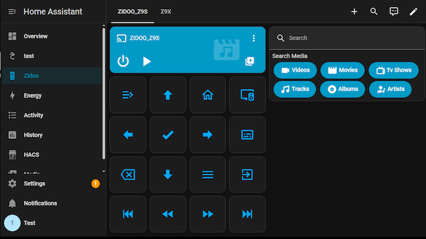
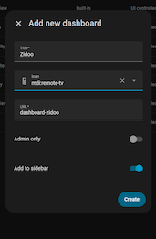
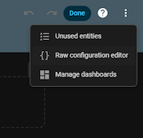
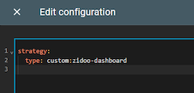

# Installing Custom Dashboard and Cards
Included in the integration package is a default Zidoo Dashboard and Search Card



 _*NOTE:  Custom cards requires the [card-tools](https://github.com/thomasloven/lovelace-card-tools) helper.  You can install it from HACS or add [manually](https://github.com/thomasloven/hass-config/wiki/Lovelace-Plugins)*_

## Zidoo Dashboard
The Zidoo dashboard automatically creates views for each installed Zidoo device, with examples of the remote button grid and search card.

1. Select "Add dashboard" in Settings/Dashboard to create a new empty dashboard (from scratch) 



2. Open the new dashboard
3. Enter dashboard edit mode (pen icon)
4. Edit the Dashboard YAML code (3-dot menu and edit raw YAML)



4. Replace the entire text with with the following code
```
strategy:
  type: custom:zidoo-dashboard
```



5. Save the changes, exit raw edit and dashboard edit modes

## Search Card
After adding the integration, 'Edit' the dashboard and add the new card using the '+Add Card' button. Select the `custom:zidoo-search-card`, then edit the yaml to include a single `entity` value with your zidoo media_player id.[^7]
 _*NOTE:  The card requires the [card-tools](https://github.com/thomasloven/lovelace-card-tools) helper.  You can install it from HACS or add [manually](https://github.com/thomasloven/hass-config/wiki/Lovelace-Plugins)*_

```
type: custom:zidoo-search-card
entity: media_player.zidoo

# Optional fields to control which Media buttons are available
# from "video","movie","tvshow","music","album","artist"
buttons:
  - movie
  - tvshow 
```
